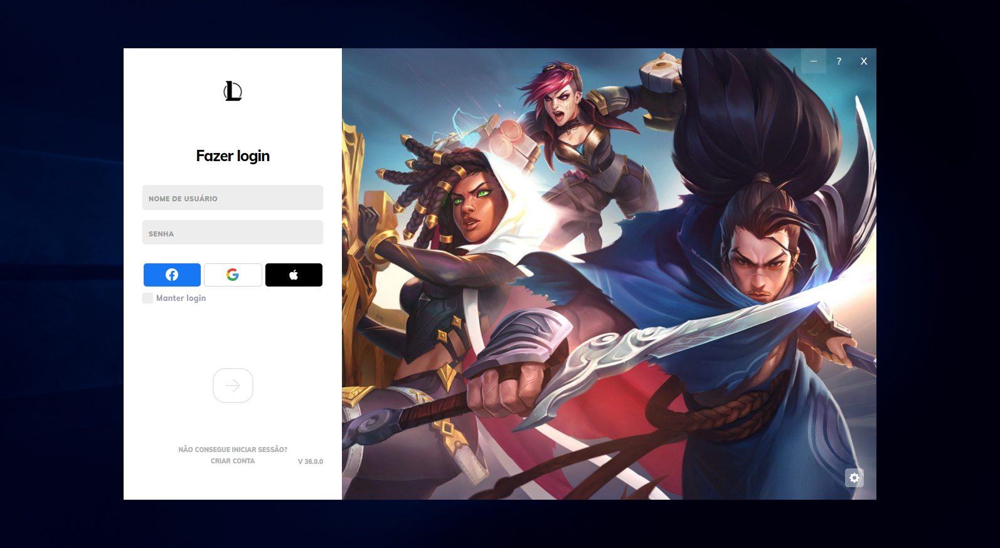
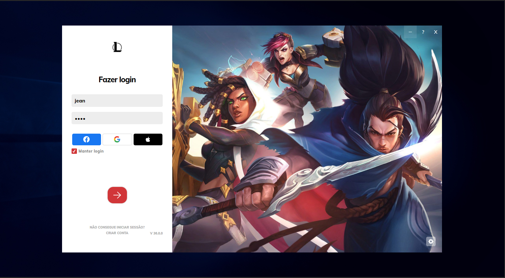
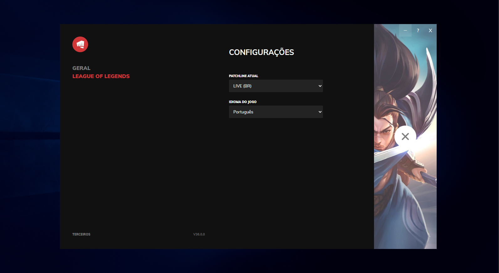

# League Of Legends Clone UI

## 📝 Sobre o Projeto
Este projeto consiste em uma cópia da interface de login do client do league of legends. 

## ⚛️ Tecnologias Utilizadas
 * React JS
 * Styled Components

 ## 💽 Como Rodar o Projeto
 para baixar as dependências utilize `npm install`  
 utilize o comando `npm start` para inicializar.

 ## 💻 Preview do Projeto

 
 
 
